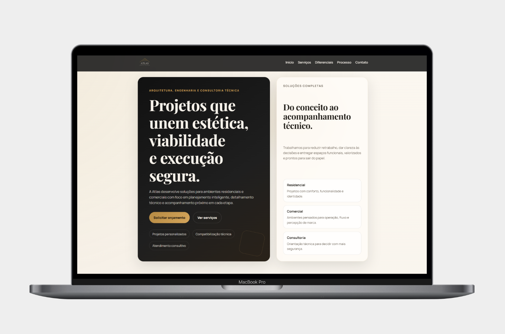
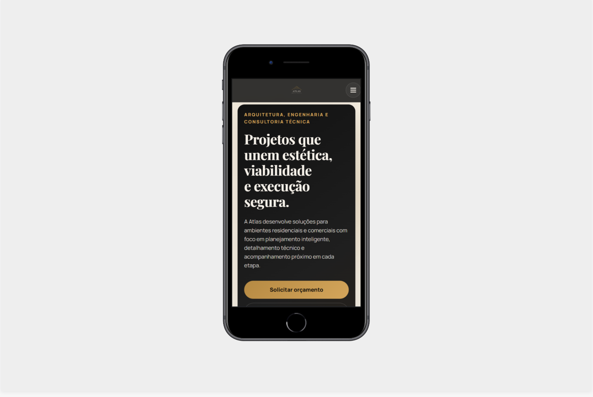
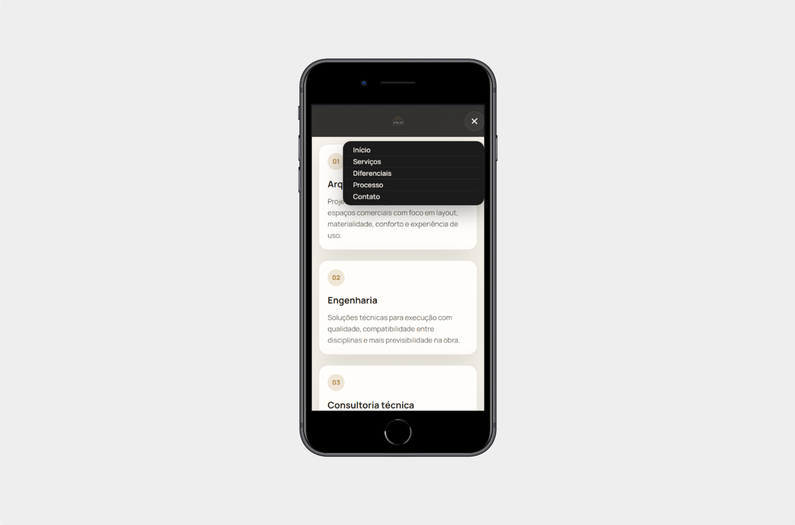

# 🏗️ Atlas Engenharia e Arquitetura — Landing Page

Landing page responsiva desenvolvida para a empresa **Atlas Engenharia e Arquitetura**, com foco em apresentação institucional, captação de clientes e experiência moderna para o usuário.

---

## 🚀 Deploy

🔗 Acesse o projeto online:
https://atlas-landing-page-swart.vercel.app/

---

## 📸 Preview

### 🖥️ Desktop



---

### 📱 Mobile

#### Home



#### Menu (Interação)



---

## 📱 Responsividade

O projeto foi desenvolvido com foco em **design responsivo**, garantindo boa experiência em:

* 📱 Dispositivos móveis
* 💻 Tablets
* 🖥️ Desktops

---

## ⚙️ Tecnologias utilizadas

* HTML5
* CSS3
* JavaScript (Vanilla)
* Vercel (deploy)

---

## 🎯 Objetivo do projeto

Este projeto foi desenvolvido com o objetivo de:

* Criar uma presença digital profissional para a empresa
* Aplicar conceitos de front-end na prática
* Desenvolver um layout moderno e responsivo
* Melhorar habilidades em estruturação de páginas e estilização

---

## ✨ Funcionalidades

* Layout moderno e intuitivo
* Navegação fluida
* Seções institucionais (sobre, serviços, contato)
* Design responsivo
* Botões de ação (CTA)
* Menu mobile interativo

---

## 🧠 Aprendizados

Durante o desenvolvimento, foram trabalhados:

* Estruturação semântica com HTML
* Estilização com CSS (Flexbox e Grid)
* Responsividade com media queries
* Organização e reutilização de código
* Deploy e versionamento com Git e Vercel

---

## 📂 Como rodar o projeto

```bash
# Clone o repositório
git clone https://github.com/tiagoibernon/atlas-landing-page

# Acesse a pasta
cd atlas-landing-page

# Abra o index.html no navegador
```

---

## 👨‍💻 Autor

Desenvolvido por **Tiago Ibernon**

- [GitHub](https://github.com/tiagoibernon)
- [LinkedIn](https://www.linkedin.com/in/ibernontiago/)

---

## 📌 Status do projeto

✅ Concluído

🔄 Possíveis melhorias futuras:

* Integração com backend para formulário
* Animações mais avançadas (UI/UX)
* Otimização de performance e SEO
* Acessibilidade (a11y)

---
